# Path-Based Routing Web Architecture using AWS Application Load Balancer (ALB)

---

## 🎯 Objective

`To design and implement a scalable web architecture using AWS Application Load Balancer (ALB) that routes incoming HTTP traffic to different EC2 web servers based on URL path patterns such as /school, /college, and /office.`

This project demonstrates **real-world path-based routing**, **listener rules**, **target groups**, and **load-balanced EC2 web servers** inside a custom VPC.

---

## 📌 Services Used

* Amazon VPC
* Amazon EC2
* Application Load Balancer (ALB)
* Target Groups

---

## 🧠 Project Concept (Very Simple)

We create:

* **1 Load Balancer**
* **3 EC2 servers**

  * School Server
  * College Server
  * Office Server

ALB decides **where traffic goes** based on URL path.

    | URL Path     | Server      |
    | ------------ | ----------- |
    | `/school/*`  | School EC2  |
    | `/college/*` | College EC2 |
    | `/office/*`  | Office EC2  |

---

## 🏗 Architecture Overview

                              ┌────────────────────┐
                              │  Client / Browser  │
                              └─────────┬──────────┘
                                        |
                                     Internet
                                        |
                            ┌──────────────────────────┐
                            │  Internet Gateway (IGW)  │
                            └───────────┬──────────────┘
                                        |
        ┌─────────────────────────────────────────────────────────────────┐
        │                      VPC (10.0.0.0/16)                          │
        │                                                                 │
        │   ┌──────────────────────────┐   ┌──────────────────────────┐   │
        │   │ Public Subnet (AZ-a)     │   │ Public Subnet (AZ-b)     │   │
        │   │ 10.0.1.0/24              │   │ 10.0.2.0/24              │   │
        │   └─────────────────────┬────┘   └────┬─────────────────────┘   │
        │   │             ┌──────────────────────────────┐            │   │   
        │   │             │ Application Load Balancer    │            │   │
        │   │             │ (Internet-Facing)            │            │   │
        │   │             │ Listener: HTTP : 80          │            │   │
        │   │             └──────────────┬───────────────┘            │   │
        │   │                            │                            │   │
        │   │                Path-Based Listener Rules                │   │
        │   │             /school*  /college*  /office*               │   │
        │   │                  |        |         |                   │   │
        │   │                  |        |         |                   │   │
        │   │            ┌────────┐ ┌────────┐ ┌────────┐             │   │
        │   │            │Target  │ │Target  │ │Target  │             │   │
        │   │            │Group   │ │Group   │ │Group   │             │   │
        │   │            │tg-     │ │tg-     │ │tg-     │             │   │
        │   │            │school  │ │college │ │office  │             │   │
        │   │            └───┬────┘ └───┬────┘ └───┬────┘             │   │
        │   │                │          │          │                  │   │
        │   │           ┌──────────┐ ┌──────────┐ ┌──────────┐        │   │
        │   │           │ EC2      │ │ EC2      │ │ EC2      │        │   │
        │   │           │ School   │ │ College  │ │ Office   │        │   │
        │   │           │ Apache   │ │ Apache   │ │ Apache   │        │   │
        │   │           └──────────┘ └──────────┘ └──────────┘        │   │
        │   │                                                         │   │
        │   └─────────────────────────────────────────────────────────┘   │
        │                                                                 │
        └─────────────────────────────────────────────────────────────────┘

---

## 🟦 Service Purpose Table

| Service             | Purpose             |
| ------------------- | ------------------- |
| **VPC**             | Private AWS network |
| **Subnets**         | Host ALB & EC2      |
| **ALB**             | Distributes traffic |
| **EC2**             | Web servers         |
| **Target Groups**   | Connect ALB to EC2  |
| **Security Groups** | Firewall rules      |
| **Apache**          | Serve web pages     |

---

# ⭐ STEP-1: Create VPC

### Go to AWS Console → **VPC** → Create VPC

### Create VPC

    - Name: alb-multi-endpoint-vpc
    - IPv4 CIDR: 10.0.0.0/16

### Create **2 public subnets** (ALB requires minimum 2 AZs).

### Subnet-1

    - Name: alb-public-subnet-1
    - AZ: ap-south-1a
    - CIDR: 10.0.1.0/24

### Subnet-2

    - Name: alb-public-subnet-2
    - AZ: ap-south-1b
    - CIDR: 10.0.2.0/24

### Create Internet Gateway

    - Name: alb-igw
    - Attach to alb-multi-endpoint-vpc

### Route Table

    - Name:`alb-public-rt
    - Route: 0.0.0.0/0 → Internet Gateway
    - Associate both public subnets

### Create Security Group

### ALB Security Group

    - Name: `alb-sg`
    - Inbound Rule:
      - HTTP (80) → `0.0.0.0/0`

### EC2 Security Group

    - Name: `web-ec2-sg`
    - Inbound Rules:
      - HTTP (80) → **Source: alb-sg**
      - SSH (22) → Your IP

---

# ⭐ STEP-2: Launch EC2 Instances (3 Servers)

Launch **3 EC2 instances**.

### Common Settings

    - OS: Amazon Linux 2
    - Type: t2.micro
    - VPC: alb-multi-endpoint-vpc
    - Subnet: Public
    - Security Group: web-ec2-sg

---

## User Data Scripts (VERY IMPORTANT)

### 🏫 School EC2

      #!/bin/bash
      yum install httpd -y
      systemctl start httpd
      systemctl enable httpd
      
      mkdir /var/www/html/school
      echo "<h1>School - Staffs</h1>" > /var/www/html/school/staffs
      echo "<h1>School - Students</h1>" > /var/www/html/school/students
      echo "<h1>School - Classes</h1>" > /var/www/html/school/classes

---

### 🎓 College EC2

      #!/bin/bash
      yum install httpd -y
      systemctl start httpd
      systemctl enable httpd
      
      mkdir /var/www/html/college
      echo "<h1>College - Faculty</h1>" > /var/www/html/college/faculty
      echo "<h1>College - Branches</h1>" > /var/www/html/college/branches
      echo "<h1>College - Fee Structure</h1>" > /var/www/html/college/fee-structure

---

### 🏢 Office EC2

      #!/bin/bash
      yum install httpd -y
      systemctl start httpd
      systemctl enable httpd
      
      mkdir /var/www/html/office
      echo "<h1>Office - Colleagues</h1>" > /var/www/html/office/colleagues
      echo "<h1>Office - Domains</h1>" > /var/www/html/office/domains
      echo "<h1>Office - Hierarchy</h1>" > /var/www/html/office/hierarchy

---

# ⭐ STEP-3: Create Target Groups

Create **3 Target Groups**.

      | Target Group | Health Check | Target      |
      | ------------ | ------------ | ----------- |
      | tg-school    | `/`          | School EC2  |
      | tg-college   | `/`          | College EC2 |
      | tg-office    | `/`          | Office EC2  |

# ==> Ensure targets show **Healthy**. <==

---

# ⭐ STEP-4: Create Application Load Balancer

      - Name: server-side-render-alb
      - Scheme: Internet-facing
      - IP Type: IPv4
      - Subnets: Both public subnets
      - Security Group: alb-sg
      - Listener: HTTP : 80

---

# ⭐ STEP-5: Configure Listener Rules (MOST IMPORTANT)

Listener → HTTP : 80 → Add rules

      | Priority | Condition        | Action               |
      | -------- | ---------------- | -------------------- |
      | 1        | Path `/school*`  | Forward → tg-school  |
      | 2        | Path `/college*` | Forward → tg-college |
      | 3        | Path `/office*`  | Forward → tg-office  |
      | Default  | None             | 404                  |

---

# ✅ Final Verification

Use **ALB DNS name**:

      http://ALB-DNS/school/staffs
      http://ALB-DNS/college/faculty
      http://ALB-DNS/office/colleagues

---

## 🎯 Key Learnings

* Path-based routing with ALB
* Listener rule priority
* Target group health checks
* Secure EC2 communication
* Real-world load balancing design

---

## 📸 Screenshots

### VPC Creation

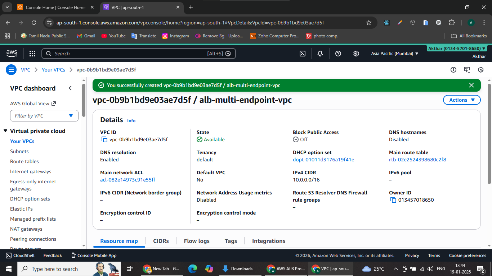

---

### Subnets Configuration

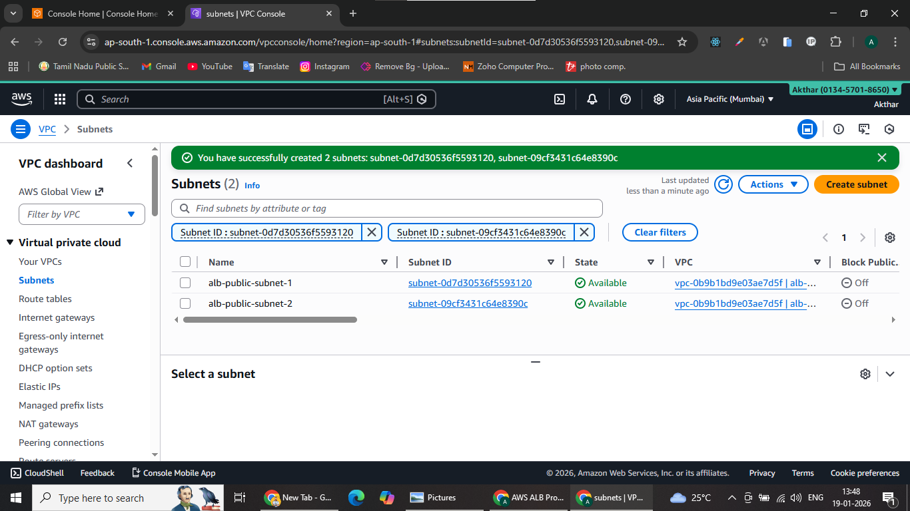

---

### Internet Gateway

---

### Route Table

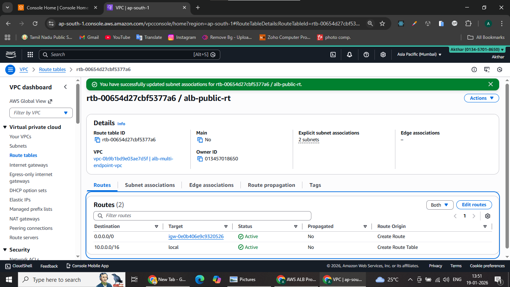

---

### ALB Security Group

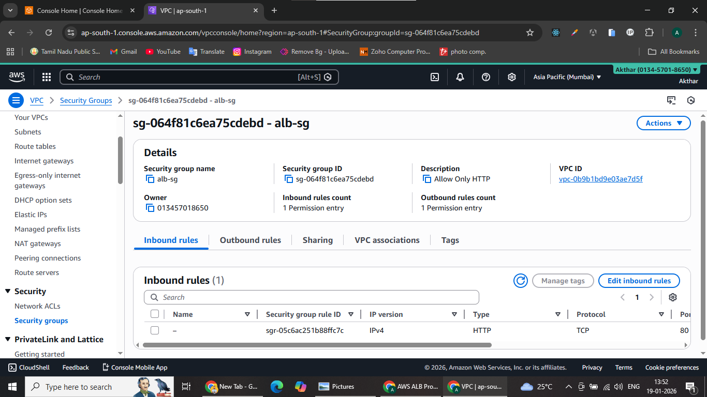

---

### EC2 Security Group

---

### School EC2 Instance

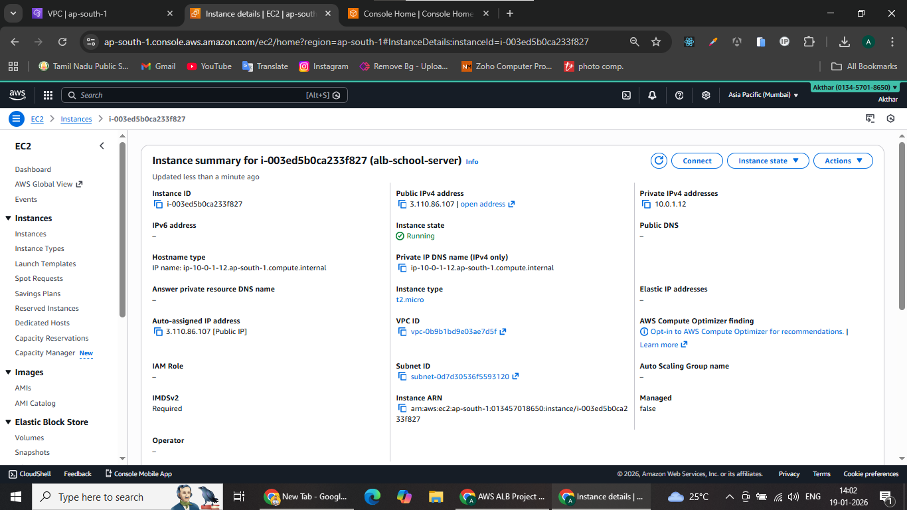

---

### College EC2 Instance

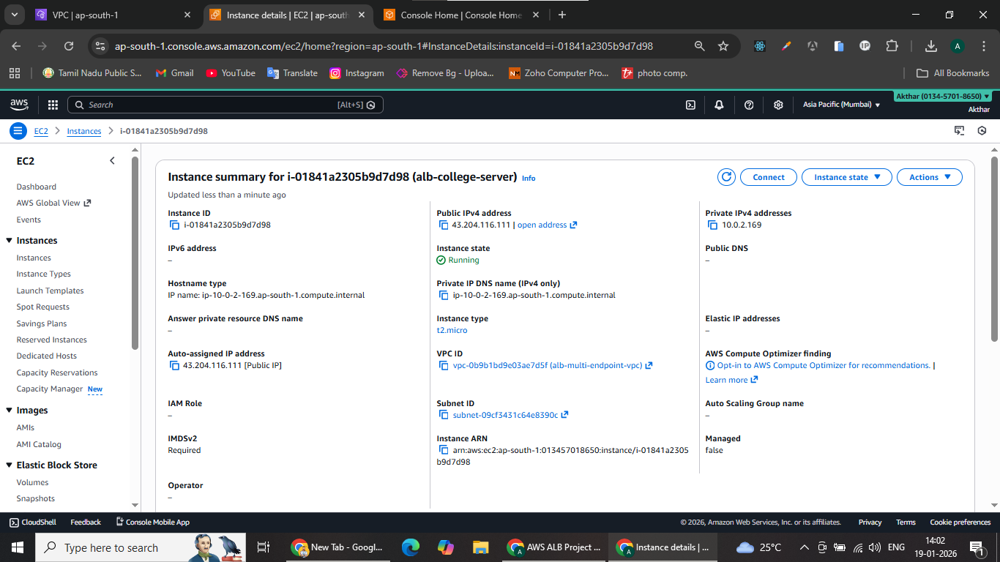

---

### Office EC2 Instance

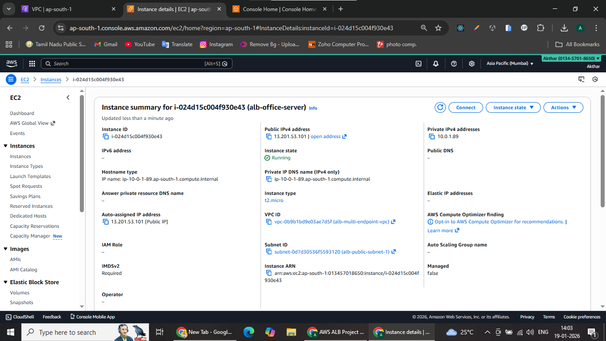

---

### Target Group – School

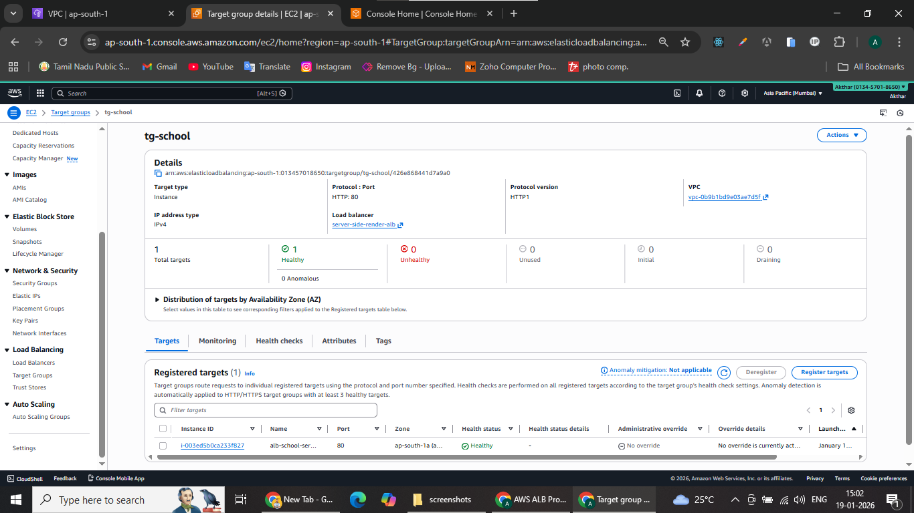

---

### Target Group – College

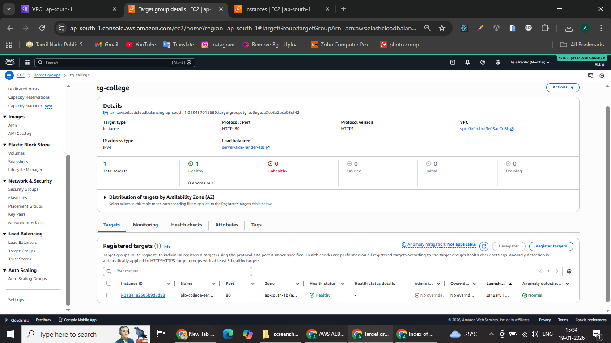

---

### Target Group – Office

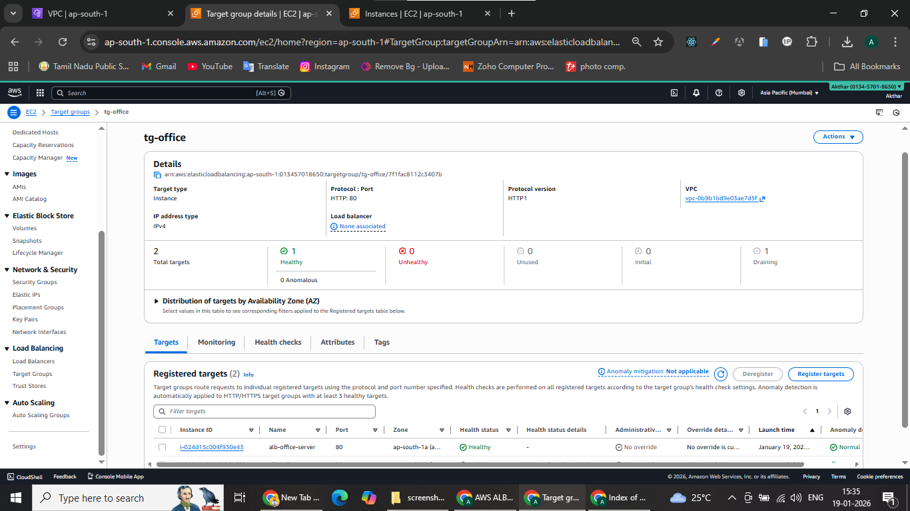

---

### Application Load Balancer

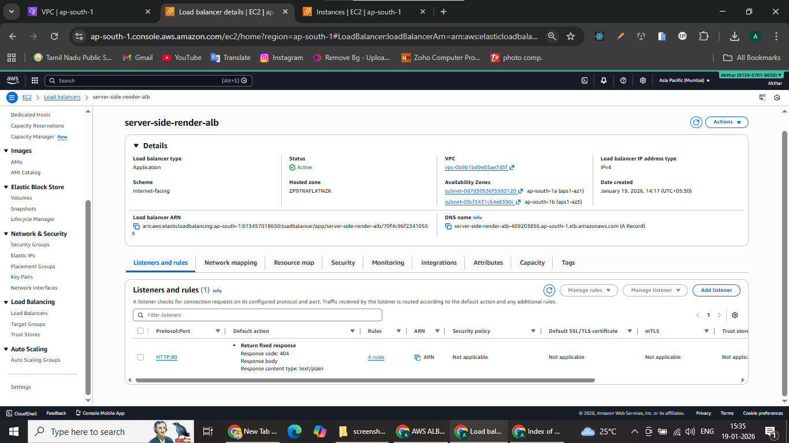

---

### ALB Listener Rules

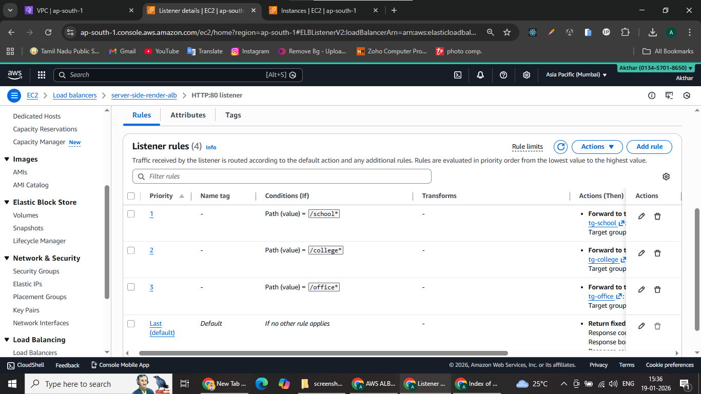

---

### ALB Public DNS Output

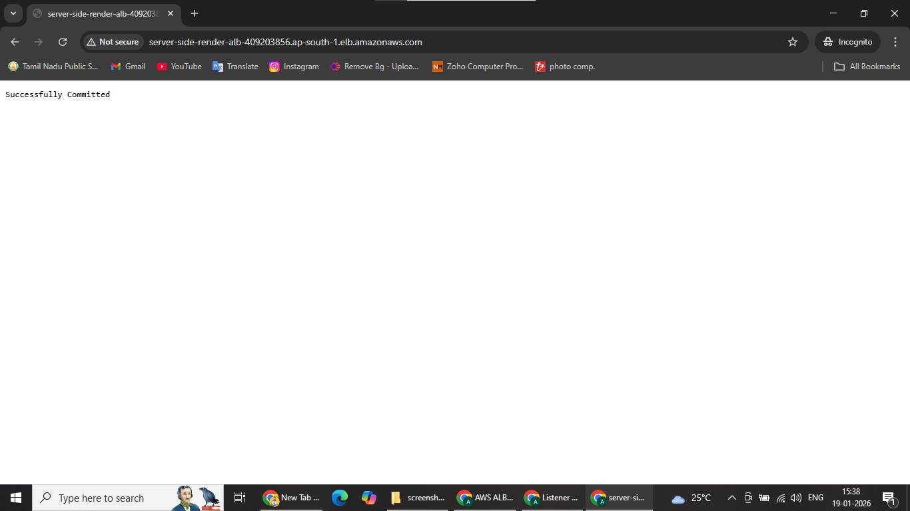

---

### Path-Based Routing – School

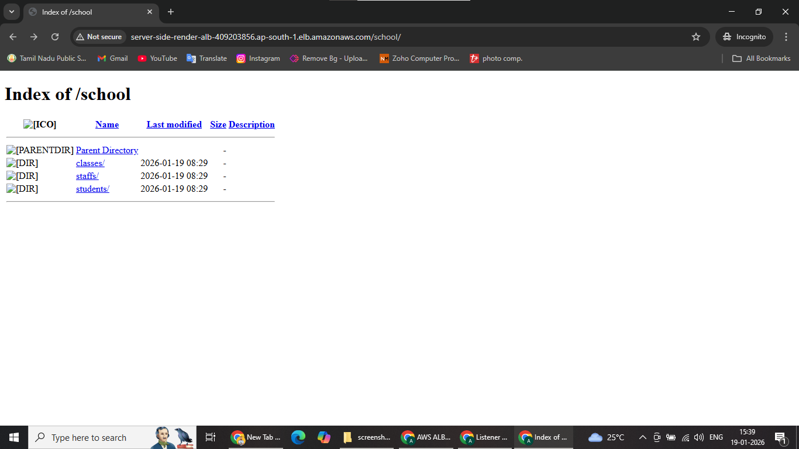

---

### Path-Based Routing – College

---

### Path-Based Routing – Office

